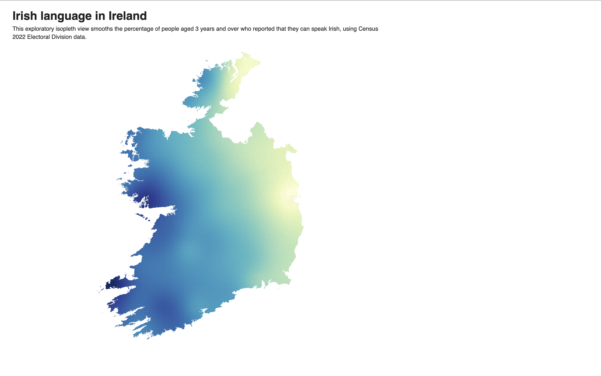

# Mapping Irish Speakers in Ireland: A County-Level Choropleth and Isopleth from Census 2022

## 1. Project overview

Irish is difficult to map without making it look simpler than it actually is. A county can be coloured, a percentage can be displayed, and a legend can make the distribution immediately readable, but the language itself does not live only inside those administrative shapes. It moves through schools, families, cities, Gaeltacht districts, symbolic attachments, partial competence, daily use, and local communities whose relation to Irish is not always captured by a single census category.

This project starts from that difficulty. It uses Census 2022 data to produce a county-level choropleth map of Irish speakers as a percentage of the total population. Its primary object is therefore not the Irish language as a whole, but one precise statistical variable: the percentage of people recorded in the census as Irish speakers in each county-level unit. The map translates that variable into colour, while the side panel gives a second level of reading by showing a short ability breakdown for the selected county.

The project also contains a second map, built at the Electoral Division scale. This second map is an exploratory isopleth. It uses smaller territorial units and then smooths the values into a continuous colour surface. This makes the distribution more local and visually more fluid, but it also makes the question of interpretation more delicate. For that reason, the isopleth keeps the smoothed surface and the original Electoral Division value separate: the colour surface is interpolated, while the reading box and the side panel give the nearest original ED value.

The project is therefore positioned between a linguistic question and a visual one: from the linguistic side, Irish cannot be reduced to one national layer; from the visual side, the maps cannot display everything at once. They have to select, filter, simplify, interpolate in one case, and explain. The purpose of this README is to make those operations visible: where the data came from, how they were prepared, why these visual forms were chosen, and where the limits of the maps remain.

## 2. Final visualisations


*Figure 1. Final interface of the county-level choropleth map, showing Irish speakers as a percentage of the total population by county-level unit.*

The same page also contains the isopleth interface. The reader can switch from the county choropleth to the Electoral Division isopleth without opening another HTML file:

```text
index.html
```

This second interface should not be read as a replacement for the choropleth. It is a different way of asking the same spatial question. The choropleth keeps the county-level statistical unit visible. The isopleth moves closer to the Electoral Division data and makes a smoother exploratory surface, while still returning to the original ED value during interaction. The separate `iso/index_iso.html` file is kept in the repository as a backup version, but the archived interface is now the switch inside the main page.



*Figure 2. Final interface of the Electoral Division isopleth map, showing the smoothed surface made from the local ED values and the reading panel kept beside the map.*

## 3. How to run the project

The project should be served through a local Python server. It should not be opened directly with `file://`, because the CSV and GeoJSON files are loaded dynamically by D3.

From the local project folder, run:

```bash
cd projet_irlandais_repo
python3 -m http.server 8030
```

Then open:

```text
http://localhost:8030/index.html?v=21
```

The buttons above the map switch between the county choropleth and the Electoral Division isopleth.

The version suffix is used to reduce browser-cache problems during development. The script also loads the data files with version suffixes.

## 4. Project files

```text
projet_irlandais_repo/
├── index.html
├── style.css
├── script.js
├── README.md
├── assets/
│   └── isopleth_map.png
├── iso/
│   ├── index_iso.html
│   ├── style_iso.css
│   └── script_iso.js
└── data/
    ├── F8002.20260619T220645.csv
    ├── F8015.20260507T100507.csv
    ├── ireland_counties.geojson
    └── isopleth/
        ├── electoral_divisions.geojson
        ├── SAPS_Table_3_1_ED_Irish.csv
        └── F8011_clean_wide.csv
```

The file `index.html` contains the structure of the web page, including the title, explanatory text, the view switch, the map containers, the panels and the script imports. The file `style.css` controls the visual layout of the page, especially the relation between the map and the county detail panel, the left-side isopleth reading panel, and the switch between the choropleth and the isopleth. The file `script.js` contains the D3 logic for the county map: loading the files, filtering the rows, matching the county names, drawing the SVG paths, applying the colour scale, handling hover and click interactions, updating the panel when the user selects a county, and loading the isopleth script when the second view is opened.

The `iso` folder contains the second visualisation. The file `index_iso.html` gives a separate backup page for the isopleth map, although the main submitted interface now opens the isopleth from `index.html`. The file `style_iso.css` keeps the layout close to the main visualisation, while placing the reading panel below the map so that it remains visible in the browser while the heavier Electoral Division layer loads. The file `script_iso.js` contains the D3 logic for the Electoral Division map: loading the ED GeoJSON and SAPS table, calculating the percentage of people who can speak Irish, building the interpolated grid, clipping the colour surface to Ireland, drawing contour lines, and updating the SVG reading box and side panel during interaction.

## 5. Data sources

The primary sources of the project are the files from which the map is built. This distinction is important since the map does not begin as an image. It begins as a relation between two kinds of material: a statistical table and a geographic file. The statistical table gives the values to be represented. The geographic file gives the shapes onto which those values can be placed. The visualisation is therefore produced by making these two sources correspond.
The main statistical source is the Central Statistics Office’s Census of Population 2022 Profile 8 - The Irish Language and Education. From that source, the project uses two downloaded comma-separated values files.

The first file is:

```text
data/F8002.20260619T220645.csv
```

This file is the main source for the colour of the map, and does not in itself contain the county-level variable used in the choropleth, meaning the Irish speakers as a percentage of the total population. In the script, the table is filtered so that only the relevant rows are retained:

```text
Census Year = 2022
Sex = Both sexes
Statistic Label = Irish speakers as a percentage of total
County of Usual Residence != State
```

This filtering step was necessary because the file contains more information than the map needs. The map requires one main percentage value per county-level unit, not the whole table (though it could be expanded in the future).

The second file is:

```text
data/F8015.20260507T100507.csv
```

This file is used for the side panel that appears when a county is selected. It provides a more detailed breakdown of Irish-language ability for the selected area. The script keeps the rows corresponding to:

```text
Census Year = 2022
Sex = Both sexes
Age Group = All ages
Frequency of speaking Irish = All Irish speakers
```

The panel then groups the values into a short ability breakdown:

```text
Total
Very well
Well
Not well
not stated
```

The geographic source is:

```text
data/ireland_counties.geojson
```

This file provides the county and city shapes drawn on the map, whilst the percentages are attached later by the script, after the names in the geographic file have been matched with the names in the census table. This is one of the central operations of the project, where the map is not simply loaded anymore, but it is fully assembled.

The isopleth uses a second geographic and statistical pair:

```text
data/isopleth/electoral_divisions.geojson
data/isopleth/SAPS_Table_3_1_ED_Irish.csv
```

The Electoral Division GeoJSON gives the smaller shapes from which the local values are positioned. The SAPS table gives the census values used by the isopleth. These files come from the web sources used for the isopleth: the CSO/GeoHive Census 2022 Table 3.1 for Irish-language ability by Electoral Division, and the Tailte Éireann/GeoHive CSO Electoral Divisions 2022 boundary layer. In this case the join is not made through county names, but through the Electoral Division identifier:

```text
ED_ID_STR
```

This is important because the isopleth would be much too fragile if it depended on matching thousands of names. The GeoJSON and the SAPS table both contain 3420 Electoral Division entries, and the script attaches the SAPS row to the matching geographic feature through this identifier. The value mapped for each ED is:

```text
Yes / Total * 100
```

The file `data/isopleth/F8011_clean_wide.csv` is also kept in the repository as a prepared supporting table from the same isopleth work, although the current isopleth script uses the SAPS table and the ED GeoJSON directly.

The Electoral Division GeoJSON in the repository is a lighter version of the working file. The original geometry was too large for a normal GitHub upload. The repository version keeps all 3420 features and keeps the `ED_ID_STR` join key, but it removes unused properties and rounds the projected coordinates to metre precision. This keeps the file usable for the web map while avoiding a data file that is unnecessarily heavy for GitHub.

## 6. Historical and linguistic background

The map begins with contemporary census data, but the variable it displays belongs to a much richer and older history. Irish is not simply a language that declined and then survived in a few residual areas. That would make the present map too easy to read. What the map shows is a present distribution, but that distribution has been shaped by older historical pressures, by the changing status of Irish in law and education, by the uneven geography of the Gaeltacht, and by the more recent movement of Irish into urban and institutional networks.

For the contemporary map, the most important point is really centered around the unevenness of its present social geography. Mac Giolla Chríost describes it as diffuse, both through Irish-speaking networks across Ireland and through fragmented communities dispersed across the Gaeltacht (Mac Giolla Chríost 2005:199). He also shows that the Gaeltacht cannot be sustained as a homogeneous and territorially coherent linguistic entity, since census data show both daily Irish use within the Gaeltacht and significant Irish-speaking populations outside it, including in cities (Mac Giolla Chríost 2005:200-203).

The Comprehensive Linguistic Study of the Use of Irish in the Gaeltacht reinforces the same caution. The study was commissioned because language use in the contemporary Gaeltacht required up-to-date data and analysis, and because census information, statutory boundaries and community realities could not simply be treated as the same thing (Ó Giollagáin et al. 2007:3). The report also explains that the statutory Gaeltacht contains areas where the majority of inhabitants are active Irish speakers, but also other areas included for language-support and preservation purposes, without a mechanism clearly differentiating all the language-community types included within those boundaries (Ó Giollagáin et al. 2007:8-9). This is why the county-level map cannot be read as a straight mapping of the real current Gaeltacht vitality.

The same caution also applies inside the category of Irish speakers itself. The map cannot show whether the Irish reported by respondents belongs mainly to school-based competence, habitual community use, regional Gaeltacht norms, local linguistic practice, or relation to the official written standard. Standardisation matters here not because the map can represent it, but because it reminds us that Irish-speaking ability is not a single social situation. The visualisation therefore has to keep the census category stable while acknowledging what that category cannot separate.

## 7. Methodology

The methodology of this project is built around a simple problem: how to join the data and the map. The census file contains rows, labels, years, categories and values, whilst the GeoJSON file contains shapes. The map then only becomes possible when one value from the census table can be attached to one geographic unit. In that sense, the work was not only to draw a map, but to make the table and the territory correspond in a controlled way.

The first step was to select the mapped variable. The CSO file contains more information than the map can use at once, so the table had to be filtered. I kept only the rows where the census year is 2022, the sex category is both sexes, and the statistic is Irish speakers as a percentage of total. This produces one main percentage value for each county-level unit. The State-level row was excluded, because it does not correspond to a county shape on the map. Here, the unit highlighted is not the individual speaker, nor the Gaeltacht district, nor the household, but the county-level statistical unit given in the census table.

The second step was to load the geographic file. The GeoJSON file gives the visible outlines of the counties and city areas, but it does not yet contain the Irish-language percentages. 

To join the data and the map was not a strightforward automatic process. Some names in the census table and in the geographic file do not appear in exactly the same form. The script therefore normalises names before comparing them and removes differences that are not meaningful for the match, such as capitalisation, accents, hyphens and some punctuation. 

The third step was to check the cases where the geographic outline and the census unit do not fully coincide. This was the most important correction made to the project. Cork City and Cork County are drawn as separate shapes on the map, but the census percentage is given for them together. The same logic applies to Limerick City and County, and to Waterford City and County. Tipperary also needed explicit treatment, because North and South Tipperary appear as separate visible shapes, while the census value is read as a pooled unit.

For that reason, the script creates a statistical key for each visible shape:

```text
Cork City + Cork County -> cork
Limerick City + Limerick County -> limerick
Waterford City + Waterford County -> waterford
North Tipperary + South Tipperary -> tipperary
```

The colour and the panel then follow this statistical key rather than the visible shape alone. When one part of a combined unit is selected, the panel gives the combined value, and the explanatory note states why the unit has been gathered in this way.

The fourth step was to reduce the information shown in the side panel. The first working version displayed too many raw rows from the detail CSV file. It was not wrong per se, in the sense that the rows came from the data, but it made the interface difficult to read. I therefore kept only the rows needed for a short ability breakdown: total, very well, well, not well, and not stated. This keeps the panel close to the source table while preventing it from becoming a second spreadsheet next to the map. 

The isopleth method follows another path because the scale of the data is not the same. Instead of working with one value per county-level unit, it works with one value per Electoral Division. The first step is therefore to attach the SAPS values to the ED shapes through `ED_ID_STR`. The script calculates the percentage of people aged 3 years and over who reported that they can speak Irish:

```text
Yes / Total * 100
```

The next step is to take the centroid of each Electoral Division. These centroids become the points from which the interpolated surface is produced. The script then builds a regular grid over the map and estimates a value for each grid cell from the nearby ED points. This produces the smoothed colour surface. The smoothing is useful because it makes a broad spatial tendency visible, but it also means that the colour is not the exact value of one Electoral Division.

This is why the interaction was a necessary part of the method, not only a decorative addition. Each grid cell keeps the nearest original Electoral Division in its data. When the reader moves over the map, the fixed reading box inside the SVG and the side panel show the original ED percentage, not the smoothed grid value. In that sense, the isopleth is allowed to be visually smooth, but the interpretation is brought back to the census unit whenever the reader asks for a value.

The final step was to clip the colour surface and the contour lines to the outline of Ireland. Without this, the interpolated grid would continue outside the actual mapped area and would make the surface look more real than it is. The clip therefore has an important role: it keeps the smoothed image inside the geographic shape that the data can support.

The methodology is therefore also interpretive in a limited but important sense. Each correction was made to keep the visualisation aligned with the structure of the dataset. The map shows county-level census percentages, and nothing more precise than that, and the side panel adds detail, but it also follows the census unit. This keeps the project readable while avoiding the main risk of the map: allowing a boundary line or a colour to say more than the data can actually support.

## 8. Visualisation design

The final visualisation is a county-level choropleth map. This choice is directly linked to the type of data. The main table gives one percentage for each county-level unit, so the map gives one colour to each corresponding area. A smoother map would have been visually attractive, but it would also have made the data appear more spatially precise than they are. The final version therefore keeps the county as the main unit of representation.

The scale is sequential because the selected variable is quantitative. The values form an ordered range, from lower to higher percentages of Irish speakers. This is why I did not use separate categorical colours. The map is not asking the reader to distinguish arbitrary groups. It asks the reader to see variation along one continuous measure.

The county borders remain visible, but they are kept visually secondary. They are needed because the data are attached to territorial units. Without them, the reader would not know which area is being interpreted, but at the same time, the border should not become more important than the value. This was also one of the reasons for keeping the final map relatively simple. 

Krum's study is helpful since the final interface depends on keeping the whole reading situation visible. A reader should be normally able to see the map, the legend and the selected-county panel without losing the relation between them. Krum argues that data visualisation can make comparison easier when the relevant information is placed in the same field of view and can be understood quickly (Krum 2014:4). In this project, that principle explains why the side panel is placed beside the map rather than separated from it.

The side panel was added because the map alone would make the colour too self-sufficient. When a county is clicked, the panel gives the main percentage and a short ability breakdown. This creates two levels of reading. The map first gives the general distribution, then the panel returns the viewer to the census categories behind the selected area. The panel was also kept deliberately short, because adding every possible row from the CSV file would have made the interface closer to a spreadsheet than to a readable visualisation.

Krum also makes the question of source transparency important for this project. A visualisation becomes more credible when it makes its data sources and design process clear, rather than leaving the viewer to trust the final image without seeing how it was produced (Krum 2014:295). This is one reason why the README gives the file names, the filters, the matching logic and the special geographic cases explicitly.

Final addition, the hover effect has been based on opacity. This avoids the problem created by moving SVG paths above one another during hover, and keeps the interaction visually effective and pleasant for a reader. 

The isopleth uses a different visual logic. It does not colour each Electoral Division separately. Instead, it transforms the ED values into a smoothed surface made of small coloured rectangles, clipped to the Irish outline. Contour lines are added above this surface to make the gradient more readable. This makes the map feel less administrative than the choropleth, but it also makes the visualisation more interpretive.

For this reason, the design keeps a fixed reading box inside the SVG. The box does not follow the cursor like a small tooltip, because the map is already visually dense. A stable box is easier to read and avoids adding another moving element over the surface. The side panel also updates on hover and gives more complete details on click. In the main interface it is kept to the left of the isopleth, so that the original ED value remains visible while the full map is still displayed. This creates a distinction between the quick reading of the map and the more deliberate reading of a selected Electoral Division.

## 9. Reading the map

The map should be read first as a general distribution, not as a complete account of Irish in Ireland. Its colour scale shows the percentage of Irish speakers in each county-level unit, with lower values and higher values placed along the same ordered scale. The first reading is therefore deliberately simple: where does the census percentage appear stronger, and where does it appear weaker? An important note here is that the useful visual of the level of fluency the speakers aknowledge having in the panel also adds a linguistically meaningful layer to the map. In particular, it is interesting to note the wide range difference between speakers who say they speak it 'very well', ususally in the lower numbers, versus the readers who note 'not well', even in the Gaeltacht areas.  

The combined units are also part of the reading of the map. Cork City and Cork County, Limerick City and County, and Waterford City and County, along with Tipperary (North and South) have to be read cautiously since it is impossible to districate the actual language level that the highly urbanized areas versus the more agrarious ones may display. It would have been interesting to evalute this particular potential difference with a statistical unit less spread throughout the whole counties. 

The isopleth should be read even more cautiously, but for a different reason. It gives a more local view, since it begins with Electoral Divisions rather than counties, but the surface itself is smoothed. The colour therefore shows a spatial tendency, not a literal territorial value. The interaction is meant to correct this possible misunderstanding. When the reader moves over the surface, the reading box gives the nearest original Electoral Division value, and this is the number that should be treated as the actual census value.

In this sense, the two maps answer different reading needs. The county-level choropleth is more stable and more directly tied to the published county unit. The isopleth is more exploratory and more sensitive to local variation, but it also needs the reader to remember that a smooth colour surface is a visual construction. Together, they make the same problem visible at two different levels of generalisation.

## 10. Limits

The limits of the project come directly from the data itself. Asking whether a person can speak Irish is not the same as asking whether Irish is used every day, whether it is spoken at home, whether it is the person’s strongest language, or whether it functions as the language of a local community. The map therefore visualises declared ability, not the whole social life of the language.

The county scale creates a second limit. A county is useful because it gives a stable unit for mapping, but it remains linguistically coarse. It can show a broad spatial distribution, but it can also hide important linguistic information, and may even look more precise than it really is. This is especially important for Irish, because the geography of the language is not simply county-shaped. A county-level map can show broad variation, but it cannot show finer networks, local densities, household transmission or community-level patterns.

The isopleth answers part of this problem by moving to the Electoral Division scale, but it creates another limit at the same time. Interpolation can suggest continuity where the original data are still attached to separate administrative units. The map is therefore not a measurement of Irish-speaking ability at every point in space. It is a smoothed visualisation made from ED centroids. This is useful for seeing a pattern, but it cannot replace the original census units.

The same caution applies to the Gaeltacht. The map does not map the Gaeltacht as such. It maps county-level census percentages. The Comprehensive Linguistic Study of the Use of Irish in the Gaeltacht shows why this distinction matters, since the statutory Gaeltacht itself contains different kinds of language communities and cannot be treated as one homogeneous linguistic space (Ó Giollagáin et al. 2007:8-10). This project therefore cannot infer Gaeltacht vitality from county colour alone.

Finally, the visualisation is limited by its own clarity. A good map must simplify. It must select one value, one scale, one visual form and one reading path. This is what makes it readable, but it is also what prevents it from being complete. The project should therefore be read as a controlled visual entry into the CSO dataset. Its strength lies in making one variable visible. Its limit lies in everything that this one variable cannot unfortunately say.

## 11. Generative AI declaration

Generative AI was used as a support tool during the project, mainly to help with debugging and with HTML and CSS, which were more unfamiliar to me. AI assistance was useful in correcting specific technical problems, especially the click interaction and the matching between county names in the CSV and GeoJSON files. It was also used to help debug the isopleth interaction, where the map itself rendered correctly but the reading box, side panel and selected outline did not update correctly. These generated or assisted code sections were tested locally and adjusted during the project. They do not represent the majority of the work.

## 12. Sources

Central Statistics Office Ireland. *Census of Population 2022 Profile 8 - The Irish Language and Education*.

Central Statistics Office Ireland and Ireland's Census Data Hub. *Table 3.1 - Population aged 3 years and over by ability to speak Irish by Electoral Divisions, Census 2022*. https://census.geohive.ie/datasets/IE-CSO::table-3-1-population-aged-3-years-and-over-by-ability-to-speak-irish-by-electoral-divisions-census-2022/about

Tailte Éireann and GeoHive. *CSO Electoral Divisions - National Statistical Boundaries - 2022 - Ungeneralised*. https://data-osi.opendata.arcgis.com/datasets/osi::cso-electoral-divisions-national-statistical-boundaries-2022-ungeneralised/about

Krum, Randy. *Cool Infographics: Effective Communication with Data Visualization and Design*. Indianapolis, IN: John Wiley & Sons, 2014.

Mac Giolla Chríost, Diarmait. *Irish in a Global Age*. 2005.

Ó Giollagáin, Conchúr, Seosamh Mac Donnacha, Fiona Ní Chualáin, Aoife Ní Shéaghdha, and Mary O’Brien. *Comprehensive Linguistic Study of the Use of Irish in the Gaeltacht: Principal Findings and Recommendations*. Dublin: The Stationery Office, 2007.
